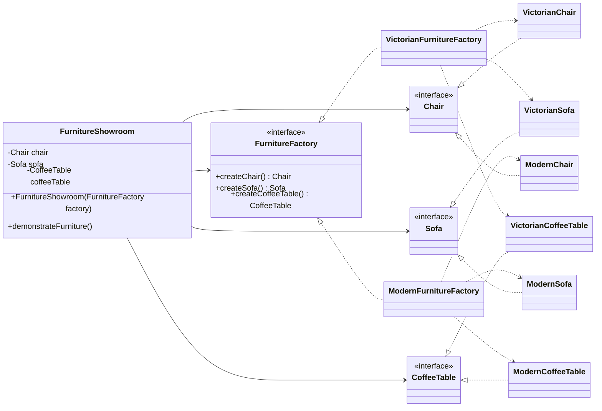

# Abstract Factory

## Definition

Abstract Factory is a creational design pattern that creates families of related objects without exposing their concrete classes.

**Category:** Creational

Each factory creates a matching chair, sofa, and coffee table. The client switches the complete furniture style by receiving a different factory.



## Main roles

- **`FurnitureFactory` — Abstract factory:** Declares the methods for creating every product in a furniture family.
- **`VictorianFurnitureFactory` and `ModernFurnitureFactory` — Concrete factories:** Create a complete set of furniture belonging to one style.
- **`Chair`, `Sofa`, and `CoffeeTable` — Abstract products:** Define the common behavior expected from each type of furniture.
- **Style-specific furniture — Concrete products:** Implement a product interface for a particular family, such as `VictorianChair` or `ModernSofa`.
- **`FurnitureShowroom` — Client:** Receives an abstract `FurnitureFactory`, uses it to create matching furniture, and interacts with the products through their interfaces.

## When to use

Use Abstract Factory when an application must create multiple families of related products, products from the same family should be used together, and client code should remain independent of their concrete classes. It works especially well when the whole product family may change based on configuration, platform, or theme.

## Run

```bash
javac *.java
java Main
```
