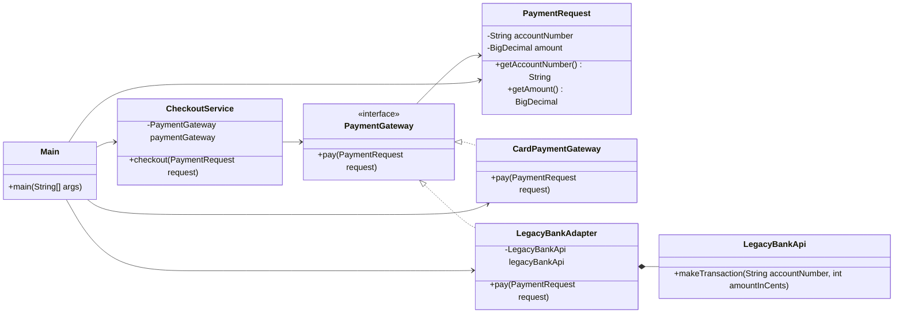

# Adapter

## Definition

Adapter is a structural design pattern that allows objects with incompatible interfaces to work together by translating the interface of one object into an interface expected by the client.

**Category:** Structural

In this example, the checkout application expects `PaymentGateway`, while a legacy bank library exposes a different method and represents money in cents. The adapter translates both the method call and the payment data.



## Main roles

- **`PaymentGateway` — Target:** Defines the interface that the checkout application understands and expects to use.
- **`CheckoutService` — Client:** Processes payments only through the target interface and remains unaware of the legacy API.
- **`LegacyBankApi` — Adaptee:** Provides useful payment behavior through an incompatible method and data format.
- **`LegacyBankAdapter` — Adapter:** Implements the target interface, wraps the adaptee, converts decimal currency into cents, and delegates the request.
- **`CardPaymentGateway` — Compatible service:** Implements the target directly and demonstrates that adapted and native services are interchangeable to the client.
- **`PaymentRequest` — Request model:** Carries validated account and payment data used by the target interface.
- **`Main` — Application setup:** Creates both a directly compatible gateway and an adapted legacy gateway for the same checkout client.

## When to use

Use Adapter when existing, legacy, or third-party code provides required behavior through an interface that does not match the one your application expects. It is especially useful when the original class cannot or should not be modified and when method calls, parameter types, units, or data formats require translation.

This example uses an object adapter: `LegacyBankAdapter` receives and wraps a `LegacyBankApi` instance through composition.

## Run

```bash
javac *.java
java Main
```
