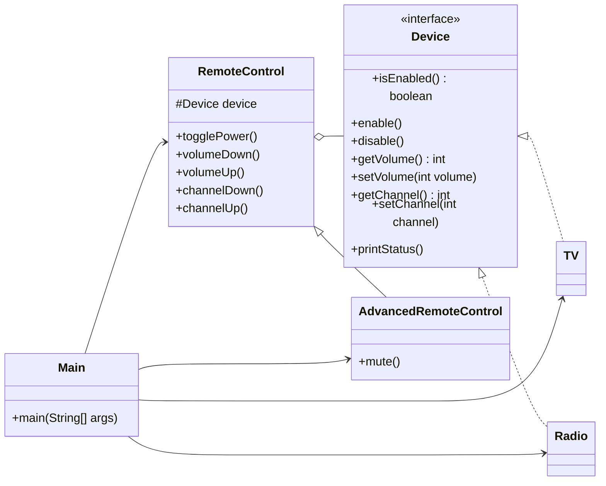

# Bridge

## Definition

Bridge is a structural design pattern that separates an abstraction from its implementation so that both hierarchies can change independently.

**Category:** Structural

In this example, remote controls form one hierarchy and devices form another. A remote contains a `Device` reference, allowing any remote type to control any compatible device without creating a class for every combination.



## Main roles

- **`RemoteControl` — Abstraction:** Defines high-level remote operations and delegates device-specific work through the implementation interface.
- **`AdvancedRemoteControl` — Refined abstraction:** Extends the basic remote behavior with an additional mute operation without changing device classes.
- **`Device` — Implementation:** Defines the low-level operations that every controllable device must provide.
- **`TV` and `Radio` — Concrete implementations:** Store device state and implement power, volume, and channel behavior in their own ways.
- **`Main` — Client:** Independently chooses a remote type and a device, then connects them through constructor injection.

## When to use

Use Bridge when a class has two independent dimensions of variation, when combining them through inheritance would create many subclasses, or when abstractions and implementations should be replaceable at runtime. New remote types and new device types can be introduced without modifying the opposite hierarchy.

Unlike Adapter, which usually connects interfaces after they become incompatible, Bridge is designed in advance to let two parts of a system evolve independently.

## Run

```bash
javac *.java
java Main
```
