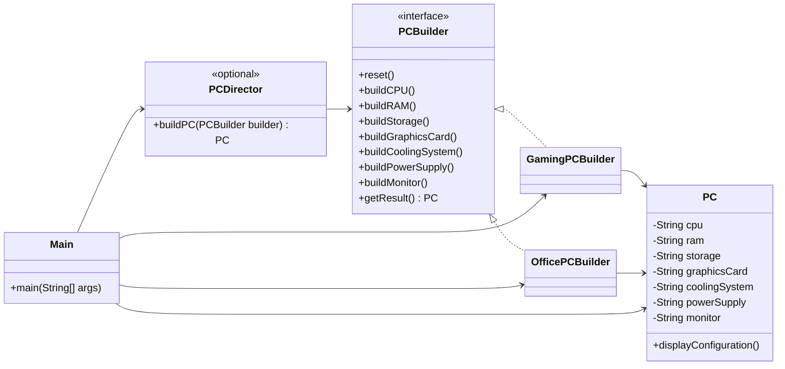

# Builder

## Definition

Builder is a creational design pattern that constructs a complex object step by step while allowing the same construction process to create different configurations.

**Category:** Creational

In this example, the same sequence of construction steps produces either a performance-focused Gaming PC or a cost-effective Office PC.



## Main roles

- **`PC` — Product:** Holds the components assembled during the construction process and displays the completed configuration.
- **`PCBuilder` — Builder:** Declares the common steps required to assemble a PC and the operation for retrieving the finished product.
- **`GamingPCBuilder` — Concrete builder:** Implements every step with performance-focused gaming components.
- **`OfficePCBuilder` — Concrete builder:** Implements the same steps with practical and cost-effective office components.
- **`PCDirector` — Optional director:** Executes the construction steps in a consistent order without depending on a particular concrete builder.
- **`Main` — Client:** Selects concrete builders, passes them to the director, and uses the resulting PCs.

## When to use

Use Builder when an object requires several construction steps, has many optional or configurable parts, or needs multiple representations built through a similar process. It keeps complex assembly logic out of the product and prevents constructors with long parameter lists.

The director is optional. Without it, the client can call the builder steps directly when it needs a custom construction sequence.

## Run

```bash
javac *.java
java Main
```
