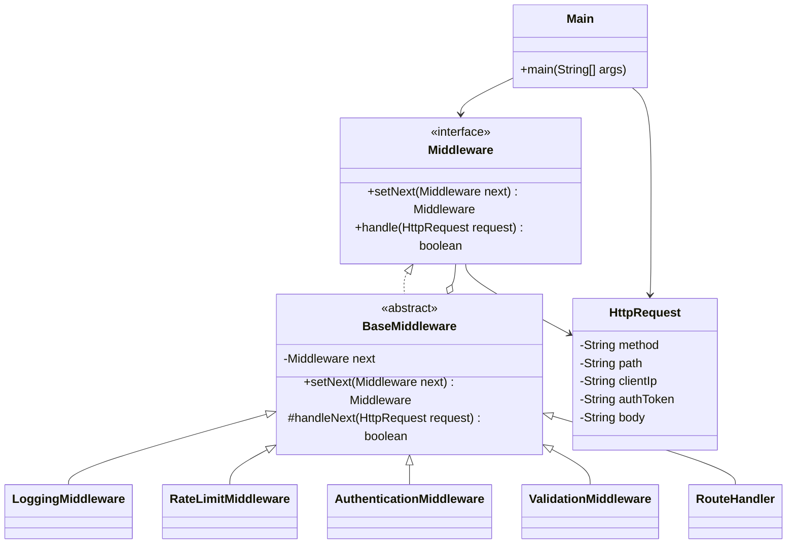

# Chain of Responsibility

## Definition

Chain of Responsibility is a behavioral design pattern that passes a request through a sequence of handlers, allowing each handler to process it, stop it, or forward it to the next handler.

**Category:** Behavioral

In plain English, an HTTP request enters one end of a middleware pipeline. Each middleware performs one job. If the request is acceptable, it calls the next middleware; if not, it ends the request immediately.

```text
Request
  → Logging
  → Rate limiting
  → Authentication
  → Validation
  → Route handler
```

The client calls only the first middleware. It does not coordinate every processing stage itself.



## Main roles

- **`Middleware` — Handler:** Defines how handlers are connected and how they receive an HTTP request.
- **`BaseMiddleware` — Base handler:** Stores the next middleware and centralizes forwarding so concrete handlers only implement their own responsibility.
- **`LoggingMiddleware` — Concrete handler:** Records every request and always forwards it.
- **`RateLimitMiddleware` — Concrete handler:** Counts requests by client IP and stops clients that exceed the configured limit.
- **`AuthenticationMiddleware` — Concrete handler:** Verifies the authentication token and stops unauthorized requests.
- **`ValidationMiddleware` — Concrete handler:** Ensures methods that modify data include a request body.
- **`RouteHandler` — Terminal handler:** Executes the application route after every preceding middleware succeeds.
- **`HttpRequest` — Request:** Carries the data examined by the handlers.
- **`Main` — Client:** Builds the pipeline and submits every request through its first handler.

## When to use

Use Chain of Responsibility when processing consists of independent stages that may be inserted, removed, reordered, reused, or allowed to stop execution. Middleware, security filters, event processing, and validation pipelines commonly use this structure.

For a small and permanently fixed sequence, ordinary conditional code may be simpler. The pattern becomes valuable when stages evolve independently or pipeline composition changes between applications, routes, or environments.

## Run

```bash
javac *.java
java Main
```
