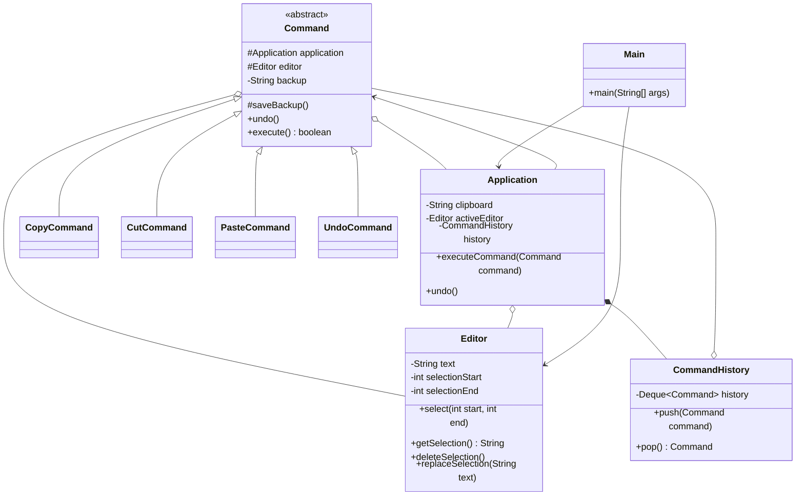

# Command

## Definition

Command is a behavioral design pattern that turns a request or operation into an object, allowing it to be stored, passed to user-interface controls, recorded in history, or undone.

**Category:** Behavioral

In this example, copy, cut, paste, and undo are command objects. Buttons or keyboard shortcuts could create the same commands, while `Application` executes them without containing their editing logic.



## Main roles

- **`Command` — Base command:** Stores the application and editor references, provides snapshot-based undo behavior, and requires concrete commands to report whether they changed editor state.
- **`CopyCommand` — Concrete command:** Copies selected text to the clipboard and returns `false` because the editor state did not change.
- **`CutCommand` — Concrete command:** Saves a backup, copies the selection, deletes it, and returns `true` so it is recorded in history.
- **`PasteCommand` — Concrete command:** Saves a backup, replaces the current selection with clipboard text, and returns `true` so it can be undone.
- **`UndoCommand` — Concrete command:** Asks the application to undo the newest stored command and returns `false` so the undo request itself is not stored.
- **`Editor` — Receiver:** Owns the text and selection and performs the actual editing operations requested by commands.
- **`Application` — Sender and invoker:** Executes command objects, owns the clipboard and active editor, and records only commands that change editor state.
- **`CommandHistory` — History:** Stores state-changing commands in last-in, first-out order.
- **`Main` — Client:** Creates the application, editor, and command objects used in the demonstration.

## How undo works

Before cut or paste changes the editor, the command saves the complete text as a backup. Returning `true` tells `Application` to push that command into history. Undo pops the newest command and restores its backup without knowing whether it was a cut or paste operation.

Copy returns `false` because it changes only the clipboard, not the editor. `UndoCommand` also returns `false`, preventing an undo operation from being added to the undo history.

## When to use

Use Command when application actions must be assigned to buttons or shortcuts, stored in history, queued, logged, scheduled, retried, or undone. The sender depends only on the base command type, while each concrete command knows the receiver and parameters required for its operation.

Command makes an action into an object. Bridge instead separates two independently varying hierarchies; it does not normally represent individual actions or maintain execution history.

## Run

```bash
javac *.java
java Main
```
