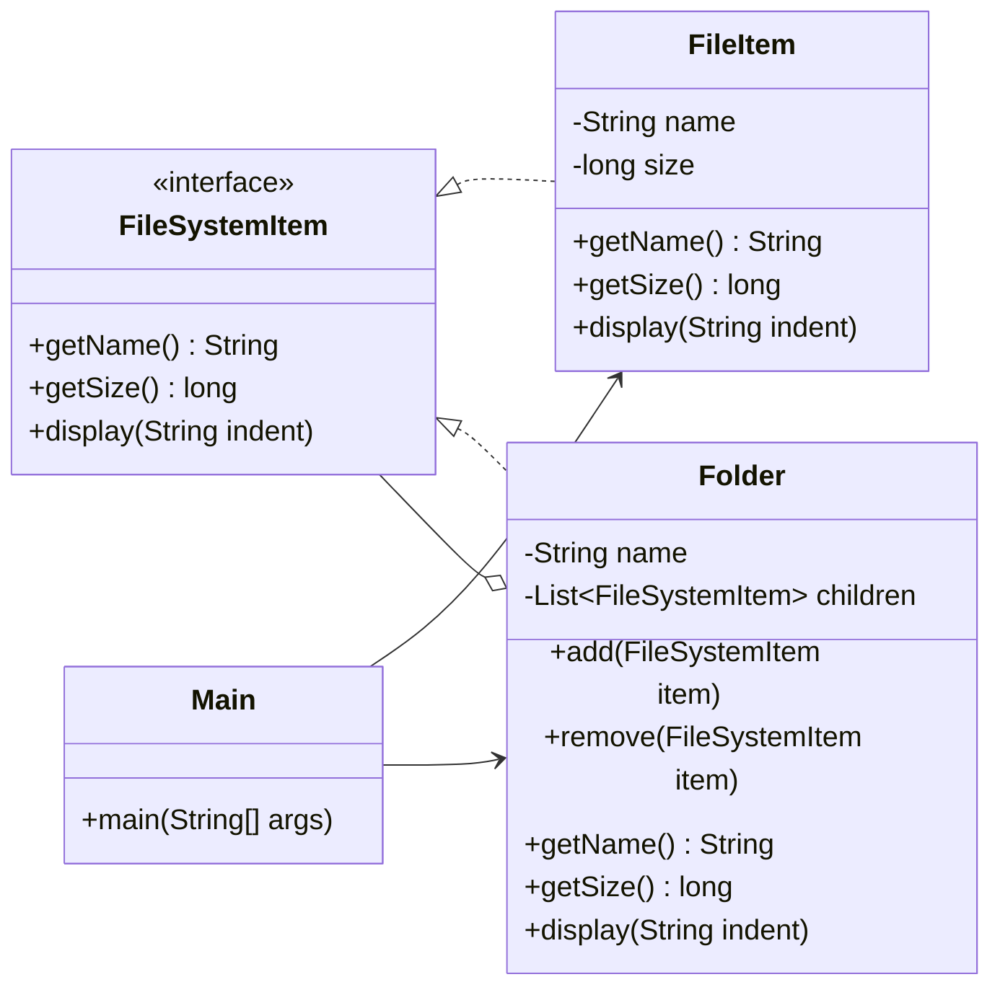

# Composite

## Definition

Composite is a structural design pattern that organizes objects into tree structures and allows clients to treat individual objects and groups of objects uniformly.

**Category:** Structural

In this example, files and folders share the `FileSystemItem` interface. A file reports its own size, while a folder recursively calculates the combined size of all files and nested folders it contains.



## Main roles

- **`FileSystemItem` — Component:** Defines the operations shared by both individual files and folders.
- **`FileItem` — Leaf:** Represents an indivisible object with no children and returns its own stored size.
- **`Folder` — Composite:** Stores child components, manages them with `add()` and `remove()`, and implements operations by delegating recursively to its children.
- **`Main` — Client:** Builds a tree and performs the same `display()` and `getSize()` operations without needing different handling for files and folders.

## When to use

Use Composite when data naturally forms a part-whole hierarchy, when groups may contain both individual items and other groups, or when clients should apply the same operation to a single object and an entire tree. Common examples include file systems, graphical user-interface trees, menus, organization structures, and product bundles.

The uniform interface simplifies client code, but it can also expose operations such as `add()` that only make sense for composites. This implementation keeps child-management operations on `Folder` rather than placing them on every component.

## Run

```bash
javac *.java
java Main
```
