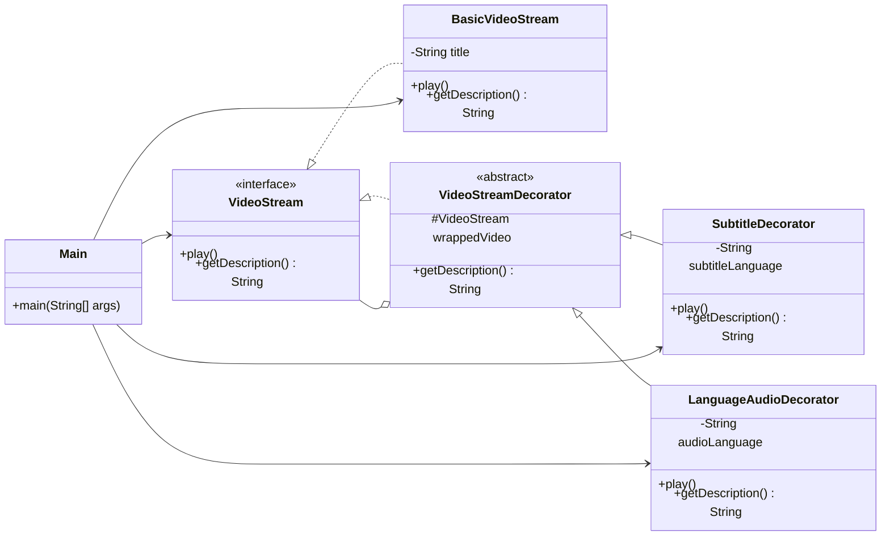

# Decorator

## Definition

Decorator is a structural design pattern that adds behavior to an object dynamically by placing it inside wrapper objects that implement the same interface.

**Category:** Structural

In this example, a basic video stream is wrapped with alternate-language audio and subtitles. Each wrapper adds behavior while preserving the `VideoStream` interface.



## Main roles

- **`VideoStream` — Component:** Defines the playback operations shared by the base stream and every decorator.
- **`BasicVideoStream` — Concrete component:** Provides the original video behavior that can be used alone or wrapped.
- **`VideoStreamDecorator` — Base decorator:** Stores another `VideoStream` and provides the common delegation structure for feature wrappers.
- **`SubtitleDecorator` — Concrete decorator:** Delegates playback and then adds subtitle rendering in a selected language.
- **`LanguageAudioDecorator` — Concrete decorator:** Delegates playback and adds an alternate audio language.
- **`Main` — Client:** Builds a decorator chain and accesses the complete pipeline through the component interface.

## When to use

Use Decorator when behavior must be added to individual objects at runtime, when features need to be combined flexibly, or when subclassing every feature combination would cause a class explosion. Decorators can be stacked, reordered, or omitted without changing the original component.

If these features were only stored as configuration values before creating the video, Builder might be more appropriate. They demonstrate Decorator here because each feature is an active wrapper that participates in playback.

## Run

```bash
javac *.java
java Main
```
