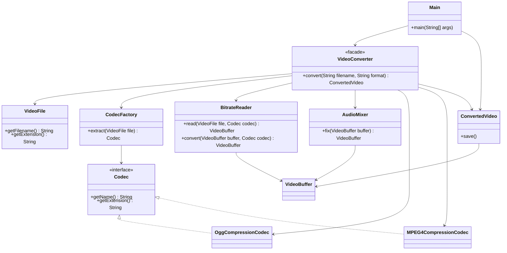

# Facade

## Definition

Facade is a structural design pattern that provides a simple, high-level interface to a complex subsystem of classes, libraries, or frameworks.

**Category:** Structural

In this example, video conversion requires codec detection, bitrate processing, format conversion, and audio repair. `VideoConverter` hides those subsystem operations behind one `convert()` method.



## Main roles

- **`VideoConverter` — Facade:** Coordinates the complete conversion workflow and exposes it through one simple method.
- **`VideoFile` and `CodecFactory` — Input subsystem:** Represent the source file and detect its compression codec.
- **`Codec`, `OggCompressionCodec`, and `MPEG4CompressionCodec` — Codec subsystem:** Represent the supported source and destination formats.
- **`BitrateReader` and `VideoBuffer` — Processing subsystem:** Read the source data and create an intermediate converted representation.
- **`AudioMixer` — Audio subsystem:** Repairs the audio associated with the converted video.
- **`ConvertedVideo` — Result:** Represents the finished conversion and provides a simple save operation.
- **`Main` — Client:** Requests a conversion through the facade without coordinating subsystem classes directly.

## When to use

Use Facade when a subsystem is difficult to use correctly, when clients should be insulated from a third-party framework, or when a system benefits from a clear entry point between architectural layers. The underlying classes can remain available to advanced clients that need their full functionality.

A facade trades some flexibility for simplicity. If the third-party framework changes, most adaptation is isolated inside `VideoConverter` instead of spreading throughout application code.

## Run

```bash
javac *.java
java Main
```
