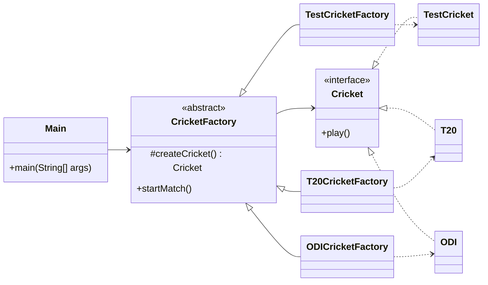

# Factory Method

## Definition

Factory Method is a creational design pattern that defines a method for creating an object while allowing subclasses to decide which concrete object to instantiate.

**Category:** Creational

In this example, `CricketFactory` defines the match-starting process but delegates cricket-format creation to its subclasses.



## Main roles

- **`Cricket` — Product:** Defines the behavior shared by every cricket format.
- **`TestCricket`, `T20`, and `ODI` — Concrete products:** Provide format-specific implementations of `play()`.
- **`CricketFactory` — Creator:** Declares the `createCricket()` factory method and contains `startMatch()`, which works with the product interface.
- **Format-specific factories — Concrete creators:** Override `createCricket()` to return their corresponding concrete products.
- **`Main` — Client:** Selects a concrete creator and starts a match through the creator's common API.

## When to use

Use Factory Method when a class needs a product but should not depend on its concrete class, when subclasses should control object creation, or when the same workflow must operate with different product implementations.

Unlike a Simple Factory, Factory Method replaces a central conditional creation method with polymorphic creator subclasses.

## Run

```bash
javac *.java
java Main
```
