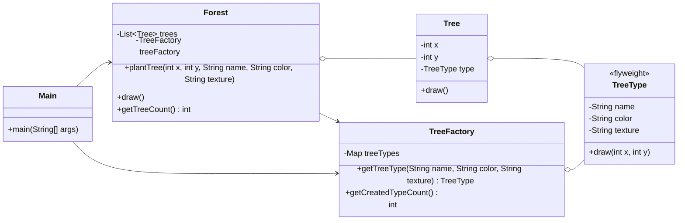

# Flyweight

## Definition

Flyweight is a structural design pattern that reduces memory usage by sharing common immutable state among many lightweight objects instead of storing the same data repeatedly.

**Category:** Structural

In this example, every tree stores its unique coordinates, while trees with the same name, color, and texture share one `TreeType` object supplied by `TreeFactory`.

| State | Stored in | Examples |
|---|---|---|
| Intrinsic and shared | `TreeType` | Name, color, texture |
| Extrinsic and unique | `Tree` | X and Y coordinates |



## Main roles

- **`TreeType` — Flyweight:** Stores the large, repeatable, and immutable intrinsic state shared by trees of the same type.
- **`Tree` — Context:** Stores unique extrinsic coordinates and delegates drawing to its shared flyweight.
- **`TreeFactory` — Flyweight factory:** Maintains a cache and returns an existing `TreeType` when the same combination is requested again.
- **`Forest` — Client structure:** Creates lightweight tree contexts and provides the external state needed when trees are drawn.
- **`Main` — Application client:** Plants multiple trees and demonstrates that five tree objects require only two shared tree types.

## When to use

Use Flyweight when an application creates a very large number of similar objects, repeated state consumes significant memory, and the repeated state can be made immutable and safely shared. Typical examples include game objects, map markers, text-editor glyphs, and cached graphical assets.

Flyweight introduces lookup and state-separation complexity, so it is most useful when measurement shows that duplicated object state is a meaningful memory cost. Unlike Prototype, which creates independent copies, Flyweight intentionally shares objects.

## Run

```bash
javac *.java
java Main
```
