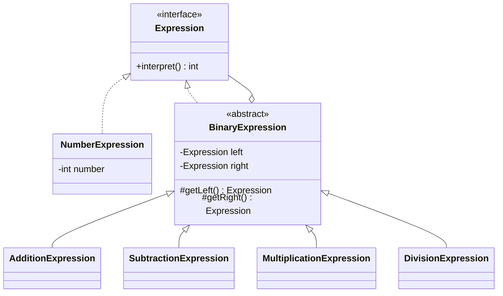

# Interpreter Pattern

## Definition

The **Interpreter Pattern** defines a representation for a language's grammar and uses that representation to interpret sentences in the language.

**Category:** Behavioral Design Pattern

In this example, a small arithmetic language supports addition (`+`), subtraction (`-`), multiplication (`*`), and integer division (`/`). Numbers are terminal expressions, while arithmetic operators are non-terminal expressions that combine other expressions.

## Problem statement

We want a calculator that can represent and evaluate arithmetic expressions. Consider:

```text
2 + 3 * 4
```

Multiplication has higher precedence, so the expression means:

```text
2 + (3 * 4)
```

The expression tree preserves that structure and evaluates to `14`.



## Main roles

- **Abstract expression — `Expression`:** Declares `interpret()`, the operation implemented by every grammar element.
- **Terminal expression — `NumberExpression`:** Represents a literal integer and returns its stored value.
- **Non-terminal base — `BinaryExpression`:** Stores the left and right operands shared by binary arithmetic rules.
- **Non-terminal expressions — `AdditionExpression`, `SubtractionExpression`, `MultiplicationExpression`, and `DivisionExpression`:** Interpret their child expressions and apply the corresponding operator.
- **Client — `Main`:** Constructs the abstract syntax tree and asks its root expression for the result.

## Grammar

The classes represent this simplified grammar:

```text
expression ::= number
             | expression + expression
             | expression - expression
             | expression * expression
             | expression / expression
```

The grammar describes which expression objects can be composed. Operator precedence is represented by the shape of the constructed tree.

## Communication flow for `2 + 3 * 4`

### 1. Client input

The client wants to evaluate `2 + 3 * 4`.

### 2. Tree creation

`Main` manually creates the corresponding abstract syntax tree:

```text
        +
       / \
      2   *
         / \
        3   4
```

```java
Expression expression = new AdditionExpression(
        new NumberExpression(2),
        new MultiplicationExpression(
                new NumberExpression(3),
                new NumberExpression(4)
        )
);
```

### 3. Recursive interpretation

```text
AdditionExpression.interpret()
    |
    +-- NumberExpression(2).interpret() = 2
    |
    +-- MultiplicationExpression.interpret()
            |
            +-- NumberExpression(3).interpret() = 3
            +-- NumberExpression(4).interpret() = 4
            +-- 3 * 4 = 12
    |
    +-- 2 + 12 = 14
```

The root returns `14` to the client.

## About parsing

This example manually builds the syntax tree so the Interpreter pattern remains easy to see. It does not convert the text `"2 + 3 * 4"` into objects by itself.

A complete calculator would add a tokenizer and parser. The parser would recognize numbers, operators, parentheses, and precedence, then create the same expression tree shown above. Interpretation begins after that tree has been built.

## Integer division

`DivisionExpression` uses Java integer division, so `7 / 2` evaluates to `3`. It checks the divisor and throws an `ArithmeticException` when division by zero is attempted.

## When to use

Use Interpreter for a small, stable language whose sentences can be represented as syntax trees. It is useful for arithmetic expressions, simple rule engines, search filters, permission rules, and configuration languages.

Avoid it for a large grammar. The number of expression classes grows with the language, while parsing, precedence, optimization, and error reporting quickly become complex. Parser generators or dedicated language-processing libraries are generally better for substantial languages.

## Interpreter vs. Composite

Interpreter often uses Composite to represent a syntax tree. Numbers are leaf nodes, while arithmetic expressions are composite nodes containing other expressions. Composite supplies the tree structure; Interpreter defines how each grammar rule is evaluated.

## Run

```bash
javac *.java
java Main
```

Expected output:

```text
Expression: 2 + 3 * 4
Result: 14

Expression: (20 - 4) / 2
Result: 8
```
