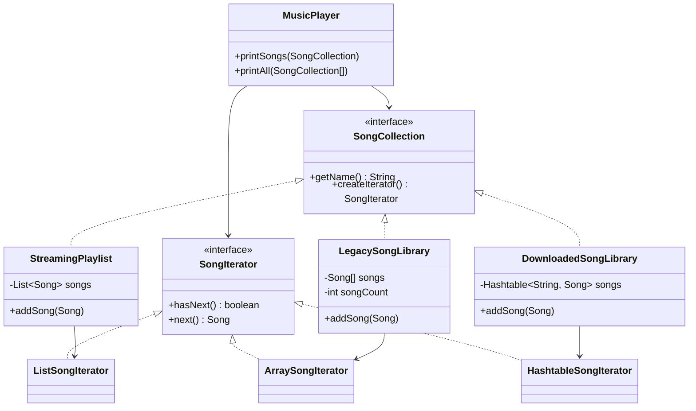

# Iterator Pattern

## Definition

The **Iterator Pattern** provides a way to access the elements of a collection one at a time without exposing how that collection stores them.

**Category:** Behavioral Design Pattern

In this example, three song libraries use different internal collections:

| Song collection | Internal storage | Iterator |
|---|---|---|
| `StreamingPlaylist` | `ArrayList<Song>` | `ListSongIterator` |
| `LegacySongLibrary` | `Song[]` | `ArraySongIterator` |
| `DownloadedSongLibrary` | `Hashtable<String, Song>` | `HashtableSongIterator` |

`MusicPlayer` can traverse all three through the same `hasNext()` and `next()` methods. It does not need to know whether a song came from a list, array, or hashtable.



## Main roles

- **Iterator — `SongIterator`:** Defines the common traversal operations, `hasNext()` and `next()`.
- **Concrete iterators:** Each one knows how to move through one particular storage structure. They also keep the current traversal position away from the collections and client.
- **Aggregate — `SongCollection`:** Gives all song collections a common method for creating an iterator.
- **Concrete aggregates:** Store songs in their preferred format and create the matching iterator.
- **Client — `MusicPlayer`:** Uses only `SongCollection` and `SongIterator`, so its traversal code works with every collection.

## Why use it here?

Without Iterator, `MusicPlayer` would need separate traversal logic: list indexing for `ArrayList`, a count for the partly filled array, and `Enumeration` for `Hashtable`. Iterator moves those differences into separate iterator classes, leaving the client with one consistent loop.

Each call to `createIterator()` also creates a separate traversal object, so multiple traversals can progress independently.

> `Hashtable` is used here to make the storage difference clear. Its traversal order is not guaranteed.

## When to use

Use Iterator when clients need to traverse collections without depending on their internal representation, when multiple collection types need one traversal interface, or when traversal state should be kept outside the collection.

Java's built-in `Iterator<T>` and `Iterable<T>` use the same idea. This example defines custom interfaces so the pattern's roles are easy to see.

## Run

```bash
javac *.java
java Main
```
