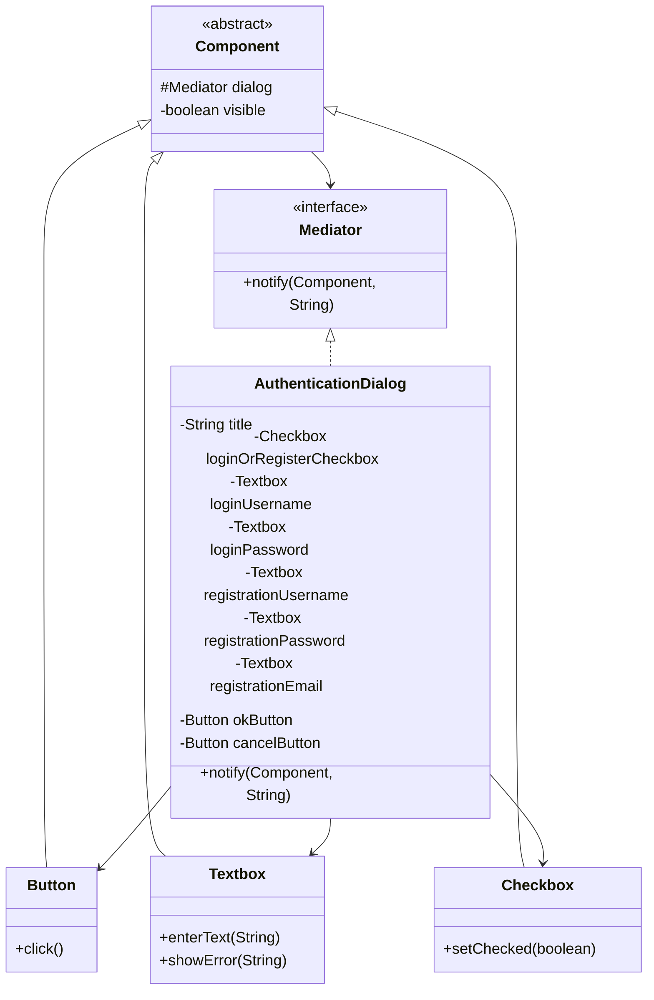

# Mediator Pattern

## Definition

The **Mediator Pattern** introduces a central object that coordinates communication between other objects, preventing them from depending directly on one another.

**Category:** Behavioral Design Pattern

In this example, the components of an authentication form do not communicate directly. They notify `AuthenticationDialog`, which decides how the rest of the form should react.



## Main roles

- **Mediator — `Mediator`:** Declares `notify()`, the single communication method used by all form components.
- **Concrete mediator — `AuthenticationDialog`:** Creates the components and contains their coordination rules. It switches between login and registration fields, validates the selected form, and handles cancellation.
- **Colleague — `Component`:** Stores a reference to the mediator, allowing reusable components to report events without knowing the complete dialog.
- **Concrete colleagues — `Button`, `Textbox`, and `Checkbox`:** Produce events such as `click`, `keypress`, and `check`. They never call one another directly.
- **Client — `Main`:** Simulates someone selecting a form mode, entering data, and clicking a button.

## How it works

When the checkbox changes, it sends a `check` event to the mediator. The mediator shows either the login fields or registration fields. When the OK button sends a `click` event, the mediator checks the selected mode and performs the correct operation.

```text
Checkbox ──check──┐
Textbox ─keypress─┼──> AuthenticationDialog ──> coordinates the form
Button ───click───┘
```

The components know only the `Mediator` interface. All relationships and interaction rules between the components are centralized inside `AuthenticationDialog`.

## When to use

Use Mediator when a group of objects has many direct dependencies or when their interaction rules are spread across several classes. It is especially useful for dialog boxes, UI forms, chat rooms, workflow coordinators, and other systems where one object should manage an interaction.

The trade-off is that the mediator can become too large if it receives unrelated responsibilities.

## Mediator vs. Publish–Subscribe

A mediator coordinates related objects and decides what should happen after an event. Publish–Subscribe mainly distributes an event to subscribers. Here, the dialog actively changes component visibility and chooses between login and registration behavior.

## Run

```bash
javac *.java
java Main
```
