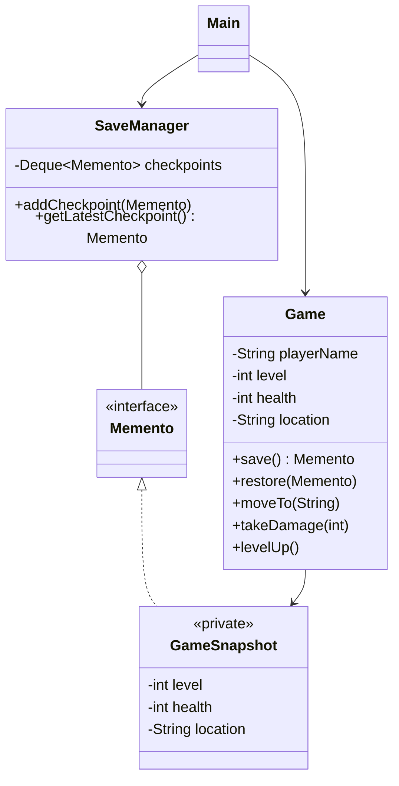

# Memento Pattern

## Definition

The **Memento Pattern** captures and stores an object's internal state so that the object can be restored later without exposing that state to other objects.

**Category:** Behavioral Design Pattern

In this example, a player saves a checkpoint before a boss fight. The game state changes during the fight, but loading the checkpoint restores the previous level, health, and location.



## Main roles

- **Originator — `Game`:** Owns the current game state. It knows how to create a snapshot and how to restore itself from one.
- **Memento — `GameSnapshot`:** Stores an immutable copy of the level, health, and location. It is private inside `Game`, so other classes cannot inspect or modify its data.
- **Caretaker — `SaveManager`:** Keeps checkpoints and returns them when requested. It handles each snapshot only through the empty `Memento` interface and therefore cannot read its contents.
- **Client — `Main`:** Changes the game state and asks the originator and caretaker to save or restore it.

## How it works

```text
Game.save() ──> snapshot ──> SaveManager
Game.restore() <──────────── SaveManager
```

1. `Game.save()` copies the current state into a private `GameSnapshot`.
2. `SaveManager` stores that object without examining it.
3. The game continues and its state changes.
4. `Game.restore()` receives the saved object and restores its earlier state.

Keeping the snapshot immutable prevents a saved checkpoint from changing after it has been created.

## When to use

Use Memento when an object needs undo, rollback, checkpoints, or version history, but its internal state should remain encapsulated. Common examples include game saves, editor history, database transactions, and restoring configuration changes.

Snapshots can consume significant memory when the saved state is large or checkpoints are created frequently.

## Memento vs. Command

- **Memento** stores what an object looked like at a particular moment.
- **Command** stores an operation or request and may reverse that operation with undo logic.

## Run

```bash
javac *.java
java Main
```
