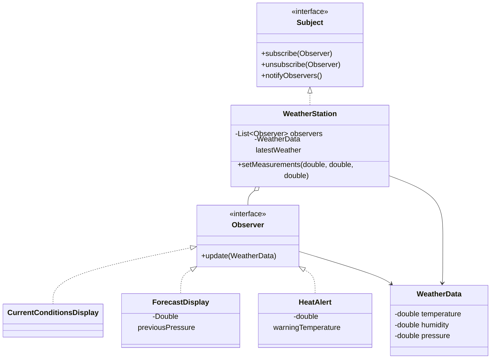

# Observer Pattern

## Definition

The **Observer Pattern** defines a one-to-many dependency between objects. When one object changes state, all of its subscribed dependents are notified automatically.

**Category:** Behavioral Design Pattern

In this example, a weather station publishes each new measurement to several independent displays. Observers can subscribe or unsubscribe without requiring changes to the station or to one another.



## Main roles

- **Subject — `Subject`:** Declares the operations for adding, removing, and notifying observers.
- **Concrete subject — `WeatherStation`:** Stores the subscriptions and broadcasts its latest immutable weather reading whenever measurements change.
- **Observer — `Observer`:** Defines the common `update()` method used to deliver a change.
- **Concrete observers — `CurrentConditionsDisplay`, `ForecastDisplay`, and `HeatAlert`:** React to the same weather reading in different ways. Each observer contains only the logic needed for its own response.
- **State object — `WeatherData`:** Carries one consistent snapshot of the station's measurements to every observer.
- **Client — `Main`:** Creates the subject and observers, manages their subscriptions, and supplies measurements.

## How it works

```text
setMeasurements()
       |
       v
 WeatherStation ──update(data)──> CurrentConditionsDisplay
       |──────────update(data)──> ForecastDisplay
       └──────────update(data)──> HeatAlert
```

1. Observers register themselves with the weather station through `subscribe()`.
2. `setMeasurements()` replaces the latest weather snapshot.
3. The station calls `update()` on every currently subscribed observer.
4. An observer can stop receiving future updates through `unsubscribe()`.

The station iterates over a copy of its observer list. This also makes notification safe if an observer changes a subscription while handling an update.

## Why use it here?

Without Observer, the weather station would need direct references to every display and alert service. Adding a new display would require editing the station. With Observer, new reactions can be added independently as long as they implement the shared interface.

## When to use

Use Observer when a change in one object should trigger reactions in an open-ended set of other objects. It is common in user-interface events, model-view updates, monitoring systems, and domain-event handling.

The trade-off is that a large or poorly managed subscription graph can make update order and cascading side effects harder to follow. Long-lived subjects must also release observers that are no longer needed.

## Observer vs. Mediator

- **Observer** broadcasts state changes to subscribed listeners without deciding how they coordinate with one another.
- **Mediator** centralizes interaction rules and decides how a group of related objects should respond to events.

## Run

```bash
javac *.java
java Main
```
