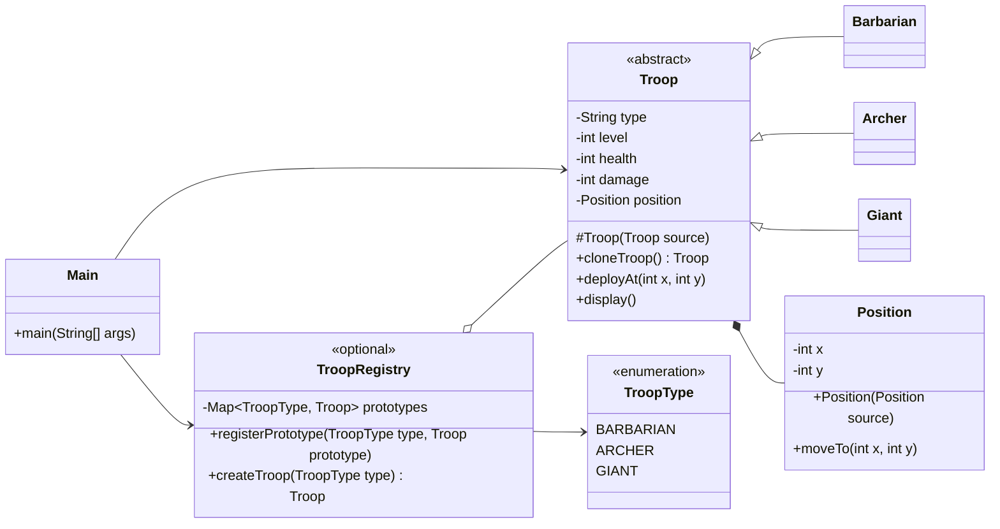

# Prototype

## Definition

Prototype is a creational design pattern that creates new objects by copying an existing object, called a prototype, instead of constructing them from scratch.

**Category:** Creational

In this example, the client can clone a locally held troop prototype directly or obtain a clone from an optional registry. Every cloned troop can be deployed at an independent position.



## Main roles

- **`Troop` — Prototype:** Stores the common troop state, declares `cloneTroop()`, and deep-copies its mutable position in the copy constructor.
- **`Barbarian`, `Archer`, and `Giant` — Concrete prototypes:** Implement cloning by invoking their copy constructors.
- **`Position` — Mutable nested object:** Is copied separately so moving one cloned troop does not move the prototype or another clone.
- **`TroopRegistry` — Optional prototype registry:** Stores configured prototypes and returns clones based on a requested troop type. It is convenient but not required by the pattern.
- **`Main` — Client:** Demonstrates both direct cloning and registry-based cloning, then customizes each clone's deployment position.

## With and without a registry

Without a registry, the client keeps a prototype and clones it directly. With a registry, the client requests a troop type while the registry manages the available prototypes. Both approaches use the same `cloneTroop()` operation; the registry only organizes prototype selection.

## When to use

Use Prototype when object construction or configuration is expensive, when many objects differ only slightly from a standard template, or when client code should create objects without depending on their concrete classes. Carefully choose between shallow and deep copying whenever a prototype contains mutable nested objects.

## Run

```bash
javac *.java
java Main
```
