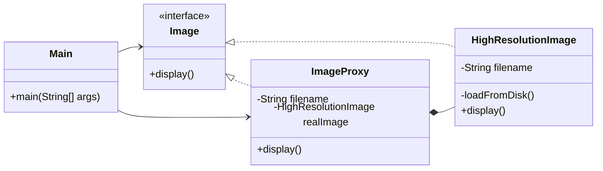

# Proxy

## Definition

Proxy is a structural design pattern that provides a substitute for another object and controls access to that object while preserving the same interface.

**Category:** Structural

In this example, `ImageProxy` represents a high-resolution image without loading it immediately. The real image is created only when `display()` is called for the first time and is then reused.



## Main roles

- **`Image` — Subject:** Defines the common interface used by both the proxy and the real object.
- **`HighResolutionImage` — Real subject:** Performs the expensive image-loading operation and displays the loaded image.
- **`ImageProxy` — Proxy:** Stores only the filename initially, creates the real subject on first access, and delegates later calls to the same instance.
- **`Main` — Client:** Works through the subject interface and does not need to know when the real image is created.

## When to use

Use Proxy when access to another object needs additional control. A virtual proxy delays expensive creation, a protection proxy checks permissions, a caching proxy reuses results, and a remote proxy represents an object located in another process or machine.

Proxy and Decorator have similar wrapper structures, but different intentions. Decorator adds optional behavior, while Proxy controls access, creation, communication, or lifecycle of the real subject.

## Run

```bash
javac *.java
java Main
```
