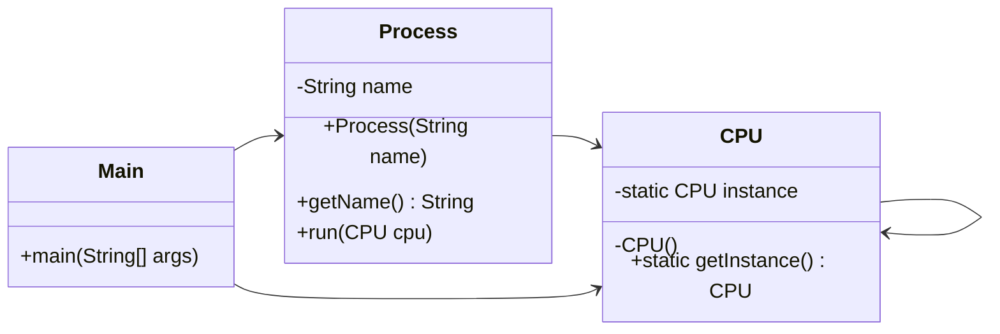

# Singleton

## Definition

Singleton is a creational design pattern that ensures a class has only one instance and provides a global access point to that instance.

**Category:** Creational

In this example, every process receives the same `CPU` instance through `CPU.getInstance()`.



## Main roles

- **`CPU` — Singleton:** Stores its only instance in a static field and prevents external construction with a private constructor.
- **`CPU.getInstance()` — Access point:** Lazily creates the instance on the first request and returns the same instance afterward.
- **`Process` — Collaborator:** Receives and works with the shared `CPU` instance instead of constructing one.
- **`Main` — Client:** Requests the singleton and supplies it to multiple process objects.

## When to use

Use Singleton when exactly one shared instance must coordinate access to a resource or service, and that constraint must be enforced by the class itself. Common examples include application configuration, registries, and process-wide resource managers. Avoid it when ordinary dependency injection can express ownership more clearly, because global state can make testing and dependencies harder to manage.

## Run

```bash
javac *.java
java Main
```
