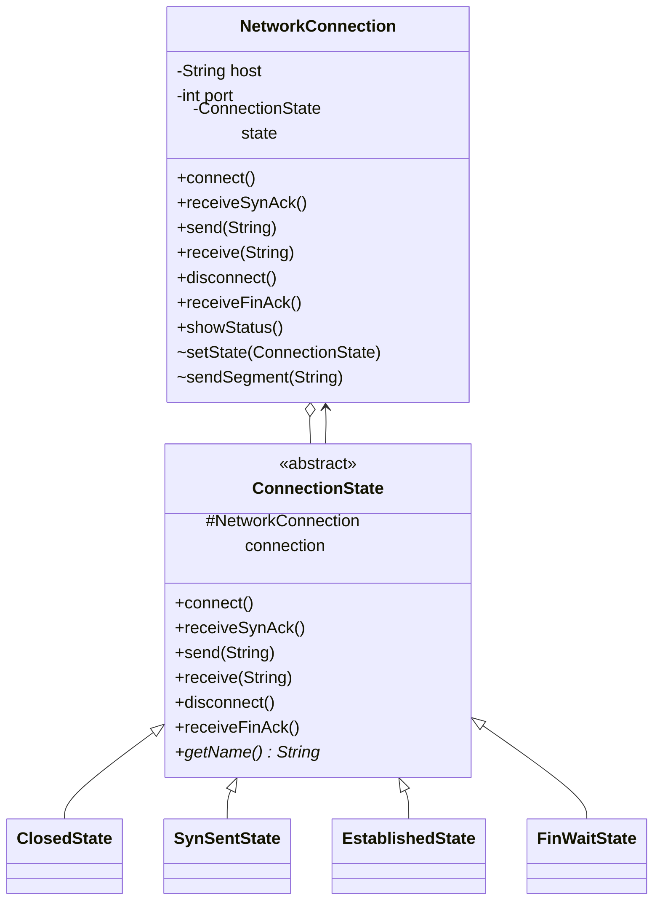
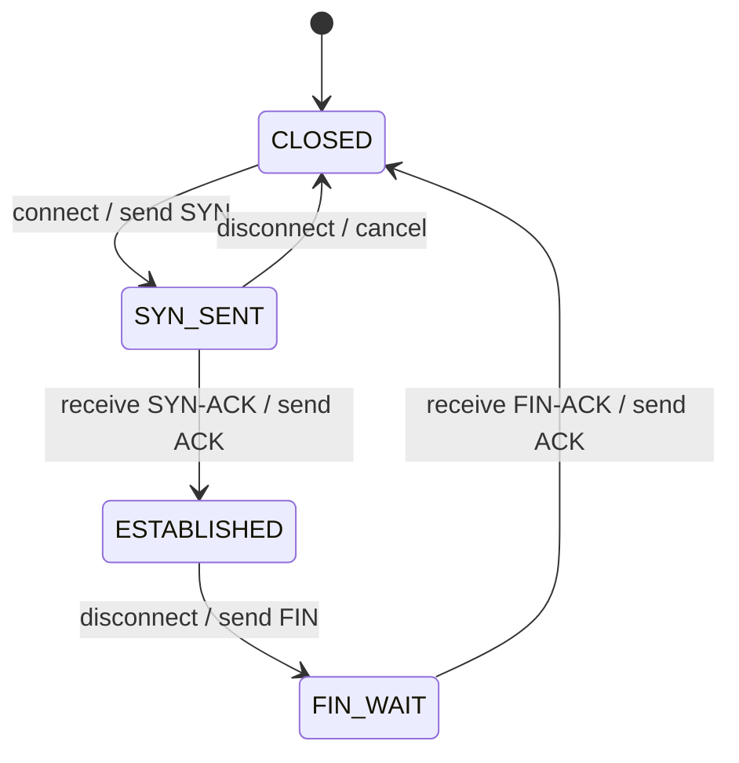

# State Pattern

## Definition

The **State Pattern** lets an object change its behavior when its internal state changes. The object appears to change its class because it delegates state-dependent operations to a different state object.

**Category:** Behavioral Design Pattern

This example models a deliberately simplified, TCP-inspired connection lifecycle. The same operation—such as sending data or disconnecting—has different behavior in the `CLOSED`, `SYN_SENT`, `ESTABLISHED`, and `FIN_WAIT` states.

> This is an educational state-machine example, not a complete TCP implementation. Real TCP has more states, timers, sequence numbers, retransmission, flow control, and error recovery.



## Main roles

- **Context — `NetworkConnection`:** Provides one stable networking API and delegates each operation to its current state.
- **State — `ConnectionState`:** Defines the protocol events and supplies default rejection behavior for events that are invalid in the current state.
- **Concrete states — `ClosedState`, `SynSentState`, `EstablishedState`, and `FinWaitState`:** Handle valid events, emit simplified protocol segments, and initiate transitions.
- **Client — `Main`:** Simulates application requests and incoming network events without choosing state objects directly.

## State transitions



Once the connection reaches `ESTABLISHED`, application data can be sent and received. The other states reject data transfer because the handshake is incomplete or shutdown is underway.

## How the pattern works

`NetworkConnection.send()` contains no `if` or `switch` statement for protocol states. It forwards the call to the current `ConnectionState` object:

```text
Application --> NetworkConnection.send(data) --> currentState.send(data)
                                                    |
                        CLOSED or SYN_SENT ---------+--> reject
                        ESTABLISHED ----------------+--> send DATA
                        FIN_WAIT -------------------+--> reject
```

Each state keeps its valid behavior and transition rules together. For example, only `SynSentState` accepts a `SYN-ACK`, and only `FinWaitState` accepts a `FIN-ACK`.

## Why protocols use finite-state machines

A protocol endpoint must interpret a message according to what happened earlier. A `SYN-ACK` is meaningful after sending `SYN`, while application data is valid only after a connection has been established. Explicit states prevent invalid combinations of boolean flags and make accepted events and transitions easier to inspect.

The State pattern is one object-oriented way to implement such a finite-state machine. A table-driven FSM can be preferable when a protocol has many states and events or when transitions need to be generated from a formal specification.

## State vs. Strategy

- **State** represents a context's current lifecycle mode. State objects commonly transition the context to one another.
- **Strategy** represents an interchangeable way to perform a task. A client usually selects the strategy, and strategies normally do not control one another.

## Run

```bash
javac *.java
java Main
```
