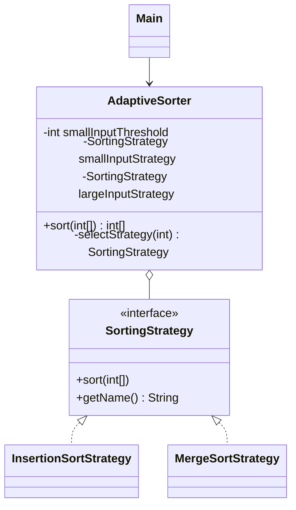

# Strategy Pattern

## Definition

The **Strategy Pattern** defines a family of algorithms, puts each algorithm in a separate class, and makes their objects interchangeable.

**Category:** Behavioral Design Pattern

In this example, `AdaptiveSorter` chooses insertion sort for small inputs and merge sort for larger inputs. Both algorithms implement the same interface, so the sorter can use either without depending on its implementation.



## Does automatic selection count as Strategy?

Yes, because the sorting algorithms are separate, interchangeable objects behind the `SortingStrategy` interface. The context delegates sorting instead of implementing the algorithms itself.

Automatic selection is an additional policy:

```text
number of elements <= threshold  --> InsertionSortStrategy
number of elements > threshold   --> MergeSortStrategy
```

If one method merely contained an `if` statement followed by two embedded sorting implementations, it would be an adaptive sorting algorithm but not necessarily the Strategy pattern. Here, the `if` only selects an object; the actual algorithms remain encapsulated in concrete strategies.

In the classic Strategy structure, the client often selects and injects one strategy directly. This example instead injects two candidate strategies and lets `AdaptiveSorter` choose between them from the input size. That is still Strategy, combined with a simple strategy-selection policy.

## Main roles

- **Strategy — `SortingStrategy`:** Defines the operation shared by every sorting algorithm.
- **Concrete strategies — `InsertionSortStrategy` and `MergeSortStrategy`:** Implement the alternative algorithms.
- **Context — `AdaptiveSorter`:** Selects a strategy from the element count and delegates sorting to it.
- **Client — `Main`:** Configures the threshold and candidate strategies, then submits arrays without choosing an algorithm for every call.

## Why choose by input size?

| Strategy | Time complexity | Extra space | Characteristic |
|---|---|---|---|
| Insertion sort | Average/worst `O(n²)` | `O(1)` | Very small setup cost; often effective for small or nearly sorted ranges |
| Merge sort | `O(n log n)` | `O(n)` | Scales predictably for larger inputs but allocates temporary storage |

For small arrays, insertion sort's simple loop can cost less than recursion and temporary-array management. As the input grows, merge sort's better asymptotic complexity becomes more important. The threshold of eight in `Main` is chosen only to make the demonstration visible; a real threshold should be measured for the actual runtime, data, and hardware.

Production sorting libraries commonly use hybrid algorithms for the same broad reason. They may use one algorithm for large partitions and switch to insertion sort for small partitions.

## Defensive copying

`AdaptiveSorter.sort()` copies the input before passing it to a strategy. Both strategies sort their working array in place, while the caller's original array remains unchanged.

This copying behavior belongs to the context and is independent of which strategy is selected.

## When to use

Use Strategy when several algorithms perform the same task, should be tested independently, or need to be replaced without changing the context. It is especially useful when algorithm selection depends on configuration, input characteristics, or runtime measurements.

The trade-off is additional classes and a selection policy that must choose appropriately. For one tiny algorithm that will never vary, Strategy may add unnecessary structure.

## Strategy vs. State

- **Strategy** represents a replaceable algorithm or policy. Here, both objects answer the question, "How should these values be sorted?"
- **State** represents a context's current lifecycle mode and usually changes which operations are valid.

## Run

```bash
javac *.java
java Main
```
