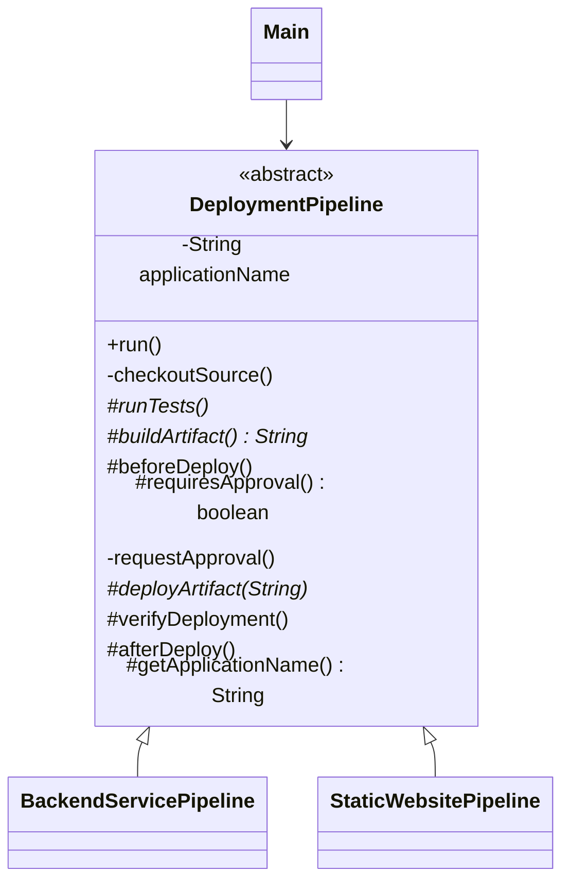

# Template Method Pattern

## Definition

The **Template Method Pattern** defines the skeleton of an algorithm in a base class while allowing subclasses to customize particular steps without changing the algorithm's overall structure.

**Category:** Behavioral Design Pattern

In this example, every deployment follows the same sequence: check out source, test, build, prepare, optionally approve, deploy, verify, and finish. Backend-service and static-website pipelines customize only the steps that differ.



## Main roles

- **Abstract class — `DeploymentPipeline`:** Owns the template method and defines the fixed deployment sequence.
- **Template method — `run()`:** Calls every deployment step in the required order. It is `final`, so subclasses cannot accidentally reorder or omit the workflow.
- **Required operations — `runTests()`, `buildArtifact()`, and `deployArtifact()`:** Abstract steps that every concrete pipeline must implement.
- **Hooks — `beforeDeploy()`, `requiresApproval()`, and `afterDeploy()`:** Optional extension points with default behavior. A subclass overrides only the hooks it needs.
- **Concrete classes — `BackendServicePipeline` and `StaticWebsitePipeline`:** Supply technology-specific steps while inheriting the common process.
- **Client — `Main`:** Runs both pipelines through the base-class API.

## The template

```text
DeploymentPipeline.run()
    |
    +-- checkoutSource()       fixed step
    +-- runTests()             required subclass step
    +-- buildArtifact()        required subclass step
    +-- beforeDeploy()         optional hook
    +-- requestApproval()      conditional fixed step
    +-- deployArtifact()       required subclass step
    +-- verifyDeployment()     overridable default step
    +-- afterDeploy()          optional hook
```

The base class controls *when* each operation happens. Subclasses control selected details of *how* it happens. This inversion of control is sometimes called the Hollywood Principle: the framework calls the subclass operations at the appropriate time.

## Required operations vs. hooks

- An **abstract operation** has no default and forces every subclass to provide the behavior.
- A **hook** has a default implementation—often empty or returning a default value—and lets subclasses participate optionally.
- A **fixed operation** is private or final because changing it would violate the algorithm's contract.

`BackendServicePipeline` uses the approval and pre-deployment hooks for a controlled service rollout. `StaticWebsitePipeline` accepts the default of no approval and adds only CDN invalidation after deployment.

## When to use

Use Template Method when several processes share the same ordered workflow but differ in a few steps. It is useful for framework lifecycle methods, data importers, test fixtures, build pipelines, request processing, and report generation.

The trade-off is inheritance coupling: every variant must fit the base class's sequence. A template with too many hooks can become difficult to understand and subclass safely.

## Template Method vs. Strategy

- **Template Method** varies selected steps through inheritance while the base class owns the algorithm's structure.
- **Strategy** delegates the complete varying algorithm to a collaborating object, favoring composition and runtime replacement.

Template Method is usually chosen when variants share a stable workflow. Strategy is preferable when the entire behavior should be freely interchangeable at runtime.

## Run

```bash
javac *.java
java Main
```
