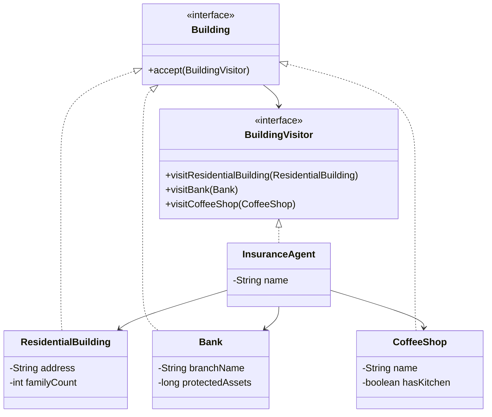

# Visitor Pattern

## Definition

The **Visitor Pattern** represents an operation to be performed on the elements of an object structure. It lets you define a new operation without changing the classes of the elements on which it operates.

**Category:** Behavioral Design Pattern

Imagine a seasoned insurance agent visiting every building in a neighborhood to find new customers. The policy offered depends on the organization occupying each building:

- A residential building receives an offer for medical insurance.
- A bank receives an offer for theft insurance.
- A coffee shop receives an offer for fire and flood insurance.

The building classes contain building data, while `InsuranceAgent` contains the insurance-specific operation for every building type.



## Main roles

- **Element — `Building`:** Declares `accept()`, which allows a visitor to enter a building.
- **Concrete elements — `ResidentialBuilding`, `Bank`, and `CoffeeShop`:** Call the visitor method associated with their own concrete type.
- **Visitor — `BuildingVisitor`:** Declares one specialized visit operation for every kind of building.
- **Concrete visitor — `InsuranceAgent`:** Implements the policy offer appropriate for each building type.
- **Object structure — `List<Building>`:** Represents the neighborhood through which the agent travels.
- **Client — `Main`:** Creates the neighborhood and sends the agent to every building.

## How it works

```text
for each building in the neighborhood
              |
              v
       building.accept(agent)
              |
      +-------+--------+----------------+
      |                |                |
 Residential         Bank          CoffeeShop
      |                |                |
 visitResidential  visitBank      visitCoffeeShop
      |                |                |
   medical           theft        fire and flood
```

The loop knows only the `Building` interface. It does not use `instanceof` or decide which policy belongs to which building. Each concrete building performs that dispatch through its `accept()` implementation.

## Double dispatch

Consider a bank visit:

```java
building.accept(agent);
```

Two runtime choices lead to the final method:

1. Java dispatches `accept()` to `Bank.accept()` based on the building object's runtime type.
2. `Bank.accept()` calls `visitor.visitBank(this)`, selecting the bank-specific operation from the visitor.

This double dispatch lets `InsuranceAgent` define specialized behavior for every building without putting insurance logic inside the building classes.

## Adding operations and element types

Adding another operation over the same buildings is easy. For example, a `SafetyInspector` could implement `BuildingVisitor` and perform different inspections at residences, banks, and coffee shops without modifying those classes.

Adding a new building type is more expensive. Introducing a hospital requires a new method in `BuildingVisitor` and a corresponding implementation in every existing visitor. Visitor therefore works best when the element hierarchy is stable but new operations are added frequently.

## When to use

Use Visitor when many distinct operations must work across a stable set of different object types, the operations need type-specific behavior, or the operations should not clutter the element classes. It is common in syntax trees, document models, reporting, auditing, and object-structure analysis.

Avoid it when new element types are added frequently, because every visitor must change whenever the element hierarchy grows.

## Visitor vs. Strategy

- **Visitor** provides one operation with specialized behavior across several element types.
- **Strategy** provides interchangeable algorithms that perform the same kind of task for a context.

## Run

```bash
javac *.java
java Main
```
